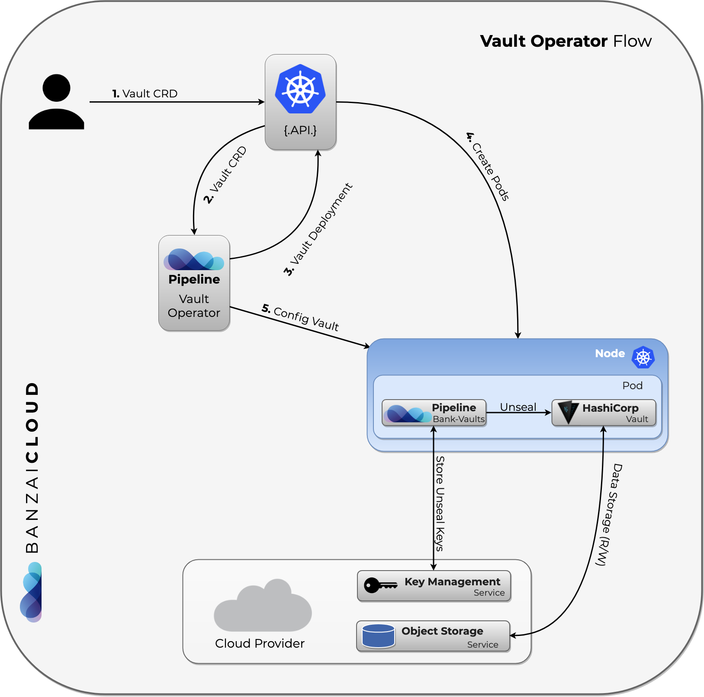

We have a Vault operator built on bank-vaults features as:

- external, API based configuration (secret engines, auth methods, policies) to automatically re/configure a Vault cluster
- automatic unsealing (AWS, GCE, Azure, Alibaba, Kubernetes Secrets (for dev purposes), Oracle)
- TLS support

The operator flow is the following:



The source code can be found inside the [operator](https://github.com/banzaicloud/bank-vaults/operator/) directory.

## Deploying the operator

The proper way for deploying the operator is to use the [Helm chart](https://github.com/banzaicloud/bank-vaults/blob/master/charts/vault-operator/README.md):

```bash
helm repo add banzaicloud-stable https://kubernetes-charts.banzaicloud.com
helm upgrade --install vault-operator banzaicloud-stable/vault-operator
```

### Create Vault instances

Some Vault CustomResource __**samples**__ can be found at the projects `operator/deploy` directory (we use these for testing).

This will create a Kubernetes `CustomResource` called `vault` and a PersistentVolumeClaim for it:

```bash
kubectl apply -f operator/deploy/rbac.yaml
kubectl apply -f operator/deploy/cr.yaml
```

Delete Vault and the PersistentVolume and RBAC:

```bash
kubectl delete -f operator/deploy/rbac.yaml
kubectl delete -f operator/deploy/cr.yaml
```

### HA setup with etcd

Additionally you have to deploy the [etcd-operator](https://github.com/coreos/etcd-operator) to the cluster as well:

```bash
helm upgrade --install vault-operator banzaicloud-stable/vault-operator --set etcd-operator.enabled=true
```

Now deploy a HA vault which connects to an etcd storage backend:

```bash
kubectl apply -f operator/deploy/rbac.yaml
kubectl apply -f operator/deploy/cr-etcd-ha.yaml
```

From now on, if you deploy a Vault CustomResource into the cluster which has an [Etcd Storage Backend](https://www.vaultproject.io/docs/configuration/storage/etcd.html) defined in its configuration the Vault operator will create an EtcdCluster CustomResource for the Vault instance, and the etcd-operator will orchestrate the etcd cluster. After the etcd cluster is ready the Vault instance can connect to it and will start up. If the Vault CustomResource is deleted from the cluster the etcd cluster will be garbage-collected as well. You have to make sure you define backup and restore for the etcd cluster to prevent data loss, this part is not handled by the Vault operator, see [this](https://github.com/coreos/etcd-operator#backup-and-restore-an-etcd-cluster) document for more details, but in general we suggest you to use [Velero](../docs/backup/README.md) for backups.

### Use existing etcd

If you want to use an existing etcd. You can set `etcdSize` vault to `< 0` (e.g.: `-1`). Then it won't create a new etcd.
And all config under etcd storage will not be override.

### Pod anti-affinity

If you want setup pod anti-affinity. You can set `podAntiAffinity` vault with a topologyKey value. 
For example, you can use `failure-domain.beta.kubernetes.io/zone` to force K8S deploy vault on multi AZ.
